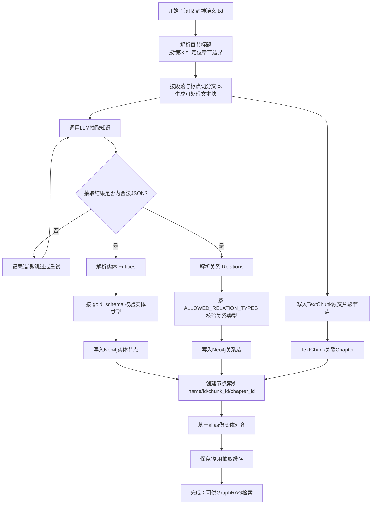
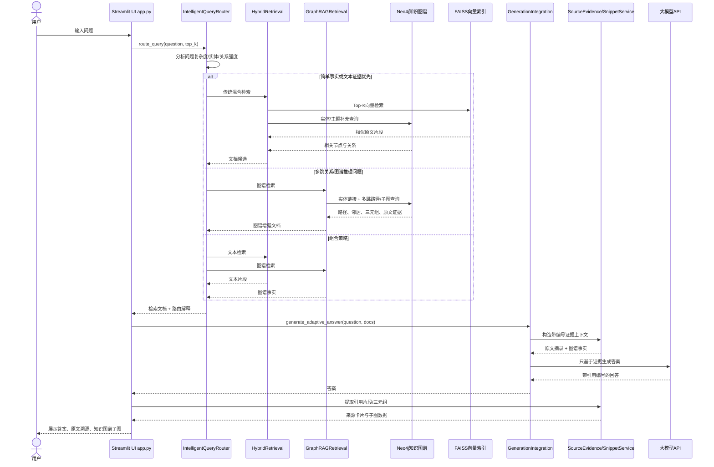
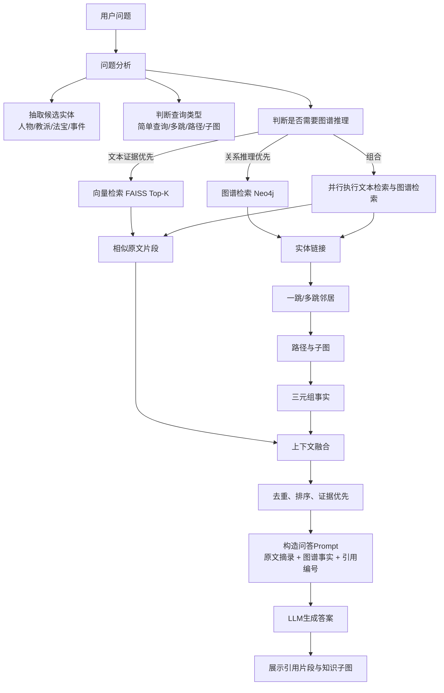
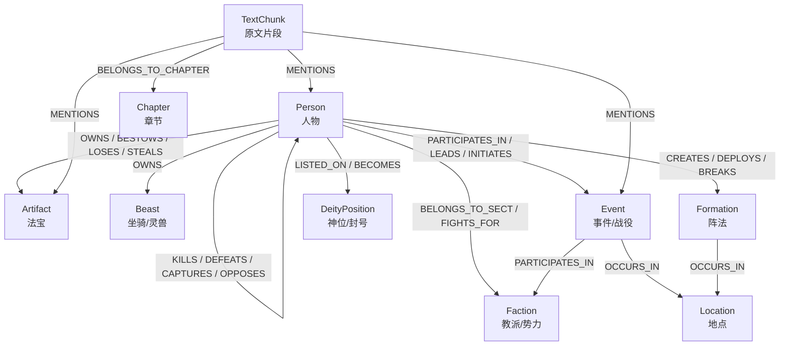
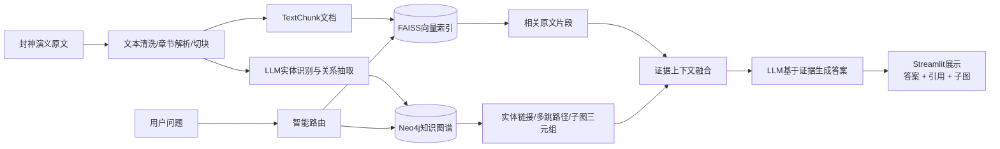

# 项目示意图 / 流程图

以下图均使用 Mermaid 编写，可直接粘贴到支持 Mermaid 的 Markdown 编辑器、Typora、Obsidian、GitHub、Mermaid Live Editor 或项目报告中渲染。

---

## 1. 系统总体架构图

```mermaid
flowchart LR
    subgraph Data[数据层]
        TXT[封神演义.txt\n99回原文语料]
        CACHE[data/fengshen/extraction_results\nLLM抽取缓存]
    end

    subgraph KGBuild[知识图谱构建层]
        SPLIT[章节解析与文本切块\nparse_chapters / split_chapter_text]
        EXTRACT[LLM知识抽取\nNER + RE Prompt]
        SCHEMA[Schema约束\nPerson/Faction/Artifact/Event/...]
        ALIGN[实体对齐\nalias合并重复实体]
    end

    subgraph Store[存储层]
        NEO4J[(Neo4j知识图谱\n实体/关系/TextChunk/索引)]
        FAISS[(FAISS向量索引\nfengshen_faiss_index)]
    end

    subgraph Retrieval[检索与路由层]
        DATA_PREP[GraphDataPreparation\nNeo4j转RAG文档]
        HYBRID[Hybrid Retrieval\nBM25 + FAISS + 图谱补充]
        GRAPH[GraphRAG Retrieval\n实体链接/多跳/子图/路径]
        ROUTER[Intelligent Query Router\n问题复杂度分析与策略选择]
    end

    subgraph Generation[生成与证据层]
        CONTEXT[上下文融合\n原文片段 + 图谱三元组]
        LLM[LLM答案生成\n只基于证据回答]
        EVIDENCE[引用与溯源\nsource_evidence/snippet_service]
    end

    subgraph UI[展示层]
        APP[Streamlit Web UI\napp.py]
        ANSWER[答案输出]
        SOURCES[原文片段引用]
        SUBGRAPH[知识图谱子图可视化]
    end

    TXT --> SPLIT
    SPLIT --> EXTRACT
    EXTRACT --> SCHEMA
    SCHEMA --> CACHE
    SCHEMA --> ALIGN
    ALIGN --> NEO4J
    SPLIT --> NEO4J

    NEO4J --> DATA_PREP
    DATA_PREP --> FAISS
    DATA_PREP --> HYBRID
    FAISS --> HYBRID
    NEO4J --> GRAPH
    HYBRID --> ROUTER
    GRAPH --> ROUTER

    ROUTER --> CONTEXT
    CONTEXT --> LLM
    LLM --> EVIDENCE

    APP --> ROUTER
    EVIDENCE --> ANSWER
    EVIDENCE --> SOURCES
    GRAPH --> SUBGRAPH
    ANSWER --> APP
    SOURCES --> APP
    SUBGRAPH --> APP
```



---

## 2. 图谱构建流程图



---

## 3. 用户问答时序图



---

## 4. 检索融合流程图



---

## 5. 知识图谱 Schema 示意图



---

## 6. 适合放在报告里的系统流程简图

如果报告只放一张图，建议使用下面这张更紧凑的版本：



---

## 7. 如果改用 Graphviz DOT

```dot
digraph FengshenGraphRAG {
  rankdir=LR;
  node [shape=box, style="rounded,filled", fillcolor="#F8F5EC", color="#8B6F47", fontname="Microsoft YaHei"];
  edge [color="#8B6F47", fontname="Microsoft YaHei"];

  Text [label="封神演义.txt\n原始语料"];
  Split [label="章节解析 / 文本切块"];
  Extract [label="LLM NER + RE\n实体关系抽取"];
  Neo4j [label="Neo4j知识图谱\n实体/关系/TextChunk/索引", shape=cylinder, fillcolor="#E8F1FA"];
  Faiss [label="FAISS向量索引\nTop-K文本检索", shape=cylinder, fillcolor="#E8F1FA"];
  Router [label="智能查询路由\n复杂度/关系强度/策略选择"];
  Graph [label="GraphRAG检索\n实体链接/多跳/子图"];
  Hybrid [label="混合检索\nBM25/FAISS/图谱补充"];
  Context [label="上下文融合\n原文片段 + 图谱三元组"];
  LLM [label="LLM证据生成\n防幻觉Prompt"];
  UI [label="Streamlit UI\n答案/引用/知识子图"];

  Text -> Split -> Extract -> Neo4j;
  Split -> Faiss;
  Router -> Graph -> Neo4j;
  Router -> Hybrid -> Faiss;
  Hybrid -> Neo4j;
  Graph -> Context;
  Hybrid -> Context;
  Context -> LLM -> UI;
}
```

---

## 8. 图片生成描述词

如果需要用 AI 绘图工具生成一张更美观的架构图，可使用以下描述：

> 生成一张中文技术架构图，主题为“《封神演义》GraphRAG 问答系统”。画面从左到右分为五层：数据层、知识图谱构建层、存储层、检索生成层、展示层。左侧是《封神演义.txt》原文数据，经过章节解析、文本切块、LLM实体识别和关系抽取，进入 Neo4j 知识图谱；文本块同时进入 FAISS 向量索引。中间是智能查询路由，根据用户问题选择向量检索、图谱多跳检索或混合检索。右侧是大模型基于“原文片段 + 图谱三元组”生成带引用的答案，最终在 Streamlit 页面展示答案、原文溯源和知识图谱子图。整体风格为学术论文架构图，浅色背景，蓝金配色，清晰箭头，模块边框圆角，中文标签简洁。不要生成代码，不要生成复杂背景。
