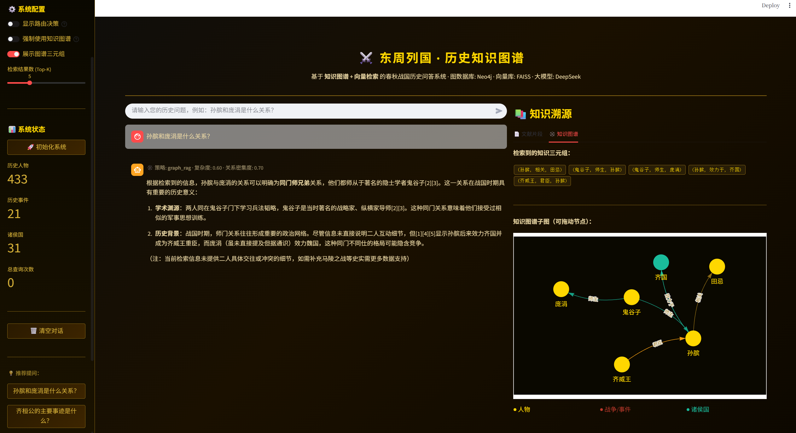

# 东周列国历史知识图谱 GraphRAG 问答系统



基于 **Neo4j 知识图谱 + FAISS 向量检索 + 大模型生成** 的春秋战国历史问答应用，提供 Streamlit Web 界面，支持：

- 人物/事件/诸侯国的检索与问答
- 人物关系、事件参与者等 **图谱关系推理（Graph RAG）**
- 文献片段引用与知识溯源（来源卡片 + 三元组展示 + 子图可视化）

> 数据主题：东周列国（春秋战国 BCE770–BCE221）

---

## 目录

- [项目结构](#项目结构)
- [运行环境](#运行环境)
- [快速开始](#快速开始)
- [配置说明](#配置说明)
- [数据导入（Neo4j）](#数据导入neo4j)
- [向量索引（FAISS）](#向量索引faiss)
- [常见问题](#常见问题)

---

## 项目结构

```
C9/
  app.py                      # Streamlit Web 应用入口
  config.py                   # 系统配置（Neo4j、FAISS、模型等）
  requirements.txt            # Python 依赖
  scripts/
    import_dongzhou_to_neo4j.py  # 将 xlsx 数据导入 Neo4j
  rag_modules/
    graph_data_preparation.py    # 从 Neo4j 读取 Person/Event/State 并构建文档
    hybrid_retrieval.py          # 混合检索（双层检索 + 向量增强 + round-robin 合并）
    graph_rag_retrieval_new.py   # 图RAG 检索（子图/多跳/路径等）
    faiss_index_construction.py  # FAISS 索引构建/加载
    generation_integration.py    # 大模型生成 + Embedding 客户端
    intelligent_query_router.py  # 查询分析与路由（传统/图RAG/组合）
  东周列国知识图谱/              # 数据目录（xlsx）
  dongzhou_faiss_index/         # 本地向量索引落盘目录（运行后生成）
```

---

## 运行环境

- Python 3.10+（建议）
- Neo4j Desktop（本地 DBMS）
- Conda 环境：你可以使用自己的环境名（例如 `mytorch`）

---

## 快速开始

### 1) 启动 Neo4j Desktop

在 Neo4j Desktop 中启动 DBMS，并确认 Bolt 连接可用（通常是 `bolt://127.0.0.1:7687`）。

### 2) 安装依赖

在项目根目录：

```bash
conda activate mytorch
pip install -r requirements.txt
```

### 3) 导入数据到 Neo4j

> 注意：该脚本会清空目标数据库（`MATCH (n) DETACH DELETE n`），请确认选对 DBMS/数据库。

```bash
python scripts/import_dongzhou_to_neo4j.py
```

数据默认读取目录在脚本中配置（可按需修改）：

- `scripts/import_dongzhou_to_neo4j.py` 内的 `DATA_DIR`

### 4) 启动 Web 应用

```bash
streamlit run app.py
```

打开页面后，在侧边栏点击 **「🚀 初始化系统」**。

---

## 配置说明

配置文件：`config.py`

- Neo4j：
  - `neo4j_uri`（bolt 地址）
  - `neo4j_user` / `neo4j_password`
  - `neo4j_database`

- 向量索引（FAISS）：
  - `faiss_index_path`：默认 `./dongzhou_faiss_index`

- 大模型与 Embedding：
  - `llm_api_base`：默认 `https://api.siliconflow.cn/v1`
  - `llm_model`：默认 `deepseek-ai/DeepSeek-V3`
  - `embedding_model`：默认 `BAAI/bge-m3`

环境变量（至少设置一个）：

- `SILICONFLOW_API_KEY`（推荐）
- 或 `OPENAI_API_KEY` / `MOONSHOT_API_KEY`

---

## 数据导入（Neo4j）

导入脚本：`scripts/import_dongzhou_to_neo4j.py`

导入后图谱包含：

- 节点（Labels）：
  - `Person`：历史人物（name、state、is_king、life_year 等）
  - `Event`：战争/事件（event_id、name、time_start、location、attacker、defender、result 等）
  - `State`：诸侯国（name）

- 关系（Relationships）：
  - `(:Person)-[:BELONGS_TO]->(:State)`
  - `(:Person)-[:ATTACKED_IN|DEFENDED_IN|ASSISTED_ATTACK_IN|ASSISTED_DEFEND_IN]->(:Event)`
  - `(:Person)-[:FRIEND_OF|ALLY_OF|RIVAL_OF|ENEMY_OF|SIBLING|FATHER_SON|TEACHER_STUDENT|LORD_MINISTER|SPOUSE|RELATED_TO]->(:Person)`

---

## 向量索引（FAISS）

初始化时会从 Neo4j 读取人物/事件信息构建文档与分块，然后建立向量索引。

索引落盘路径：

- `config.py` 的 `faiss_index_path`（默认 `./dongzhou_faiss_index`）

---

## 常见问题

### 1) 提示数据库无数据

请先运行导入脚本：

```bash
python scripts/import_dongzhou_to_neo4j.py
```

### 2) Neo4j 连接失败

确认 Neo4j Desktop 已启动 DBMS，并检查 `config.py` 中的 `neo4j_uri/user/password/database`。

### 3) 向量索引太大不想提交

本仓库默认 `.gitignore` 已忽略 `dongzhou_faiss_index/` 等索引产物；数据目录 `东周列国知识图谱/` 会被保留提交。
